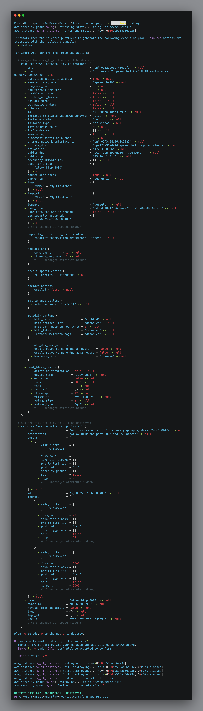

# 🚀 Terraform AWS EC2 Deployment - Node.js Web App

This project demonstrates how to use **Terraform** and **AWS** to provision an EC2 instance, configure security settings, and automatically deploy a Node.js web application. It follows Infrastructure as Code (IaC) principles to make your infrastructure reproducible, automated, and version-controlled.

---

## 📁 Project Structure

```

terraform-aws-project/
│
├── main.tf           # Terraform configuration for EC2 and Security Group
├── variables.tf      # Input variables used in main.tf
├── deploy.sh         # EC2 user\_data script to install Node.js and deploy app
├── terraform.tfstate # Terraform state file (auto-generated)
├── README.md         # Documentation (this file)

````

---

## 📸 Screenshots

| Screenshot | Description |
|-----------|-------------|
| ✅  | Terraform initialized successfully |
| 🛠️  | Plan shows resources to be created |
| 📦  | Terraform applied and infrastructure deployed |
| 🧨  | Resources destroyed to clean up the environment |
| 🌠| Node.js app running in browser (port 3000) |


---

## 🔧 How It Works

### Step 1: Initialize Terraform

```bash
terraform init
````

Initializes the Terraform environment and downloads the AWS provider.

---

### Step 2: Review the Execution Plan

```bash
terraform plan
```

Displays what Terraform will do before applying any changes. Helps in understanding what resources will be created.

---

### Step 3: Apply the Terraform Configuration

```bash
terraform apply
```

* Provisions an EC2 instance using the AMI: `ami-02521d90e7410d9f0` Ubuntu x86_64
* Opens port `3000` (for web app) and `22` (for SSH) via a security group
* Automatically runs `deploy.sh` on the EC2 instance to:

  * Install Node.js
  * Clone the GitHub repo: [`To_Do_WebApp`](https://github.com/pratikwayal01/To_Do_WebApp)
  * Start the Node.js app

---

### Step 4: Access the Web App

* After deployment, access the Node.js app in your browser using:

  ```
  http://<public_ip>:3000
  ```

---

### Step 5: Destroy Resources (Cleanup)

```bash
terraform destroy
```

Tears down the EC2 instance and security group to avoid ongoing costs.

---

## ☁️ Terraform & AWS Resources Used

* **Provider**: AWS (`region = "ap-south-1"`)
* **EC2 Instance**: Ubuntu (`t2.micro`)
* **Security Group**: Allows ingress on ports `22` and `3000`
* **User Data Script**: Bootstraps the instance to install and run the app

---

## 📜 Infrastructure as Code (IaC)

This project follows **IaC principles**:

* All infrastructure is defined in code (`main.tf`, `variables.tf`)
* Version-controlled and repeatable deployment
* Easily shareable and auditable setup
* Automates manual EC2 and app setup steps via `deploy.sh`

---

## 📂 Files Explained

### `main.tf`

Defines the AWS provider, security group, and EC2 instance. Uses:

* `aws_security_group`: Opens ports 3000 and 22
* `aws_instance`: Launches an EC2 instance with `user_data` to deploy the app

### `variables.tf`

Parameterizes the setup for reuse and configurability.

### [deploy.sh](deploy.sh)

Bootstraps the EC2 instance:

```bash
# Installs Node.js and dependencies
# Clones GitHub repo
# Runs the Node.js app in background
```

---

## ✅ Prerequisites

* Terraform installed
* AWS CLI configured with IAM user credentials
* GitHub repo publicly accessible

---

## 👨‍💻 Author

**Pratik Wayal**
📧 [LinkedIn](https://linkedin.com/in/pratikwayal) | 🌐 [GitHub](https://github.com/pratikwayal01)

---

## 📌 Notes

* Make sure to update your AMI ID if it becomes deprecated.
* Don’t forget to run `terraform destroy` to avoid charges.
* Keep secrets (like credentials) out of Terraform files.

---

## 🛡️ Disclaimer

This project is for educational purposes. Do **not** open ports publicly in production environments without additional security.
